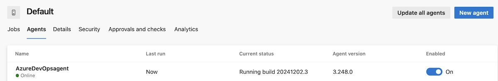
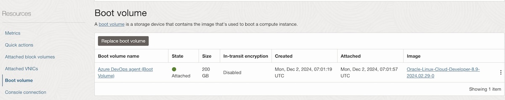

### Resource Manager Terraform Stack to create Azure DevOps Agent on OCI

Deploy Azure Devops Agent creation stack to OCI Resource Manager (Terraform) using the button below.

Stack then allows to configure the agent parameters for the Agent and VM creation:
<ul>
    <li>Agent and VM name</li>
    <li>Azure DevOps organization url</li>
    <li>Azure DevOps PAT</li>
    <li>Agent pool name (default is 'Default')</li>
    <li>VM shape (OCPUs, memory and boot volume disk size)</li>
</ul>

 
You can delete the created resources any time using stack destroy and re-create them again using the stack apply.
VM can also be stopped and started per preference.

Terraform provider oracle/oci is installed so this Agent can be used also for Terraform pipelines including https://marketplace.visualstudio.com/items?itemName=ms-devlabs.custom-terraform-tasks 

 

Terraform takes a moment to complete and eventually the build agent should appear in Azure DevOps agent pool.

 

VM boot volume size is 200M by default that can be adjusted per build needs.

